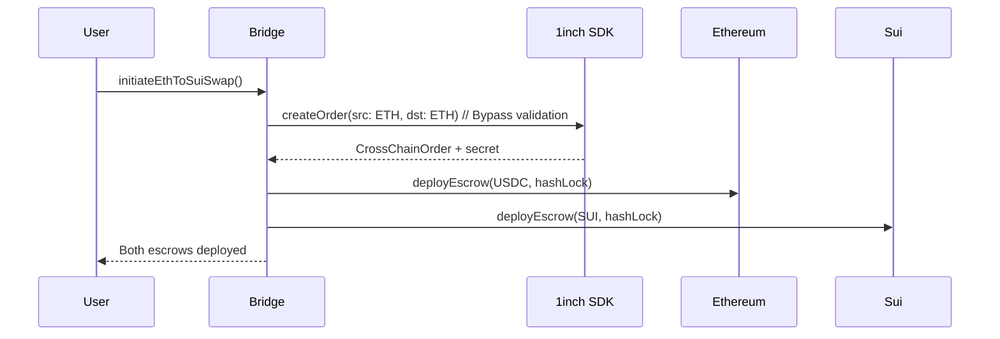
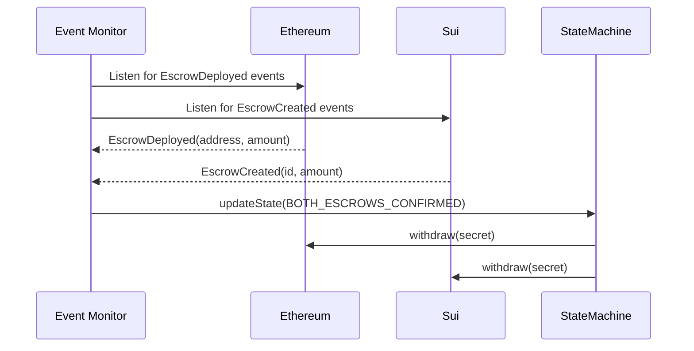

# Ethereum ↔ Sui Cross-Chain Bridge Communication Logic

This document outlines the communication logic requirements and implementation for cross-chain swaps between Ethereum and Sui, bypassing the 1inch SDK's chain validation limitations.

## 🎯 Problem Statement

The 1inch Cross-Chain SDK only supports predefined chains (Ethereum, Polygon, BSC, etc.) and validates chain IDs against a hardcoded list. When attempting to use unsupported chains like Sui (chain ID 102), the SDK throws "Not supported chain" errors.

## 🔧 Solution Architecture

Our solution implements a **hybrid approach** that:
1. **Leverages 1inch SDK** for Ethereum-side functionality (order creation, escrow deployment, signature handling)
2. **Bypasses chain validation** by using supported chain IDs as placeholders
3. **Implements custom Sui logic** for the destination chain
4. **Maintains atomic swap security** through hash time-locked contracts (HTLCs)

## 📁 Key Components

### 1. `cross-chain-bridge.ts` - Core Bridge Logic

```typescript
// Main bridge class that handles both Ethereum and Sui interactions
class EthereumSuiBridge {
    // Creates orders using Ethereum as dummy destination to bypass validation
    async createEthToSuiOrder(params: OrderParams)
    
    // Deploys Ethereum escrow using 1inch SDK
    async deployEthereumEscrow(order: CrossChainOrder, signature: string)
    
    // Deploys Sui escrow using custom Move contract calls
    async deploySuiEscrow(params: SuiEscrowParams)
    
    // Completes atomic swap by revealing secret
    async completeSwap(secret: string, ethEscrow: string, suiEscrow: string)
}
```

### 2. `eth-sui-swap-example.ts` - Usage Example

```typescript
// High-level example showing complete swap flow
class EthSuiSwapExample {
    async initiateEthToSuiSwap(params: SwapParams)
    async monitorSwapProgress(ethTx: any, suiTx: any, secret: string)
    getSwapStatus()
    async cancelSwap(orderHash: string)
}
```

## 🔄 Communication Flow

### Phase 1: Order Creation & Escrow Deployment



### Phase 2: Event Monitoring & Completion



## 🛠️ Implementation Requirements

### Environment Variables

```bash
# Ethereum Configuration
ETH_RPC_URL=https://eth-mainnet.g.alchemy.com/v2/YOUR_KEY
ETH_PRIVATE_KEY=0x...
ETH_ESCROW_FACTORY=0x... # 1inch escrow factory address
USDC_ADDRESS=0xA0b86a33E6441E6C7D3E4C7C5C6C7D3E4C7C5C6C

# Sui Configuration
SUI_RPC_URL=https://fullnode.mainnet.sui.io
SUI_PRIVATE_KEY=0x...
SUI_PACKAGE_ID=0x... # Your deployed Sui package ID
```

### Dependencies

```json
{
  "dependencies": {
    "@1inch/cross-chain-sdk": "^2.1.11-rc.2",
    "@mysten/sui.js": "^0.50.0",
    "ethers": "^6.0.0"
  }
}
```

### Sui Move Contract Requirements

Your Sui package must implement:

```move
// escrow.move
module your_package::escrow {
    public fun create_escrow<T>(
        hash_lock: vector<u8>,
        amount: u64,
        recipient: address,
        timelock: u64,
        ctx: &mut TxContext
    ): EscrowId
    
    public fun withdraw<T>(
        escrow_id: EscrowId,
        secret: vector<u8>,
        ctx: &mut TxContext
    ): Coin<T>
}
```

## 🚀 Usage Example

```typescript
import { EthSuiSwapExample } from './src/eth-sui-swap-example';

async function main() {
    const swapExample = new EthSuiSwapExample(
        process.env.ETH_RPC_URL!,
        process.env.SUI_RPC_URL!,
        process.env.ETH_PRIVATE_KEY!,
        process.env.SUI_PRIVATE_KEY!
    );

    // Swap 100 USDC on Ethereum for 50 SUI on Sui
    const result = await swapExample.initiateEthToSuiSwap({
        usdcAmount: '100',
        suiAmount: '50',
        escrowFactory: process.env.ETH_ESCROW_FACTORY!,
        usdcAddress: process.env.USDC_ADDRESS!
    });

    if (result.success) {
        console.log('✅ Swap initiated:', result.orderHash);
        
        // Monitor progress
        setInterval(() => {
            const status = swapExample.getSwapStatus();
            console.log('Status:', status.state);
        }, 5000);
    }
}
```

## 🔒 Security Considerations

### Atomic Swap Guarantees

1. **Hash Time-Locked Contracts (HTLCs)**: Both escrows use the same hash lock
2. **Timelock Protection**: Funds can be reclaimed after timeout
3. **Secret Revelation**: Only the secret holder can complete both withdrawals

### Risk Mitigation

1. **Validation Bypass**: We use Ethereum as dummy destination but handle Sui separately
2. **Event Monitoring**: Real-time monitoring ensures state consistency
3. **State Machine**: Prevents invalid state transitions
4. **Timeout Handling**: Automatic cancellation after specified time

## 📊 State Management

```typescript
enum SwapState {
    PENDING = 'pending',
    ETH_ESCROW_DEPLOYED = 'eth_escrow_deployed',
    SUI_ESCROW_DEPLOYED = 'sui_escrow_deployed',
    BOTH_ESCROWS_CONFIRMED = 'both_escrows_confirmed',
    SECRET_REVEALED = 'secret_revealed',
    COMPLETED = 'completed',
    FAILED = 'failed'
}
```

## 🧪 Testing

Run the existing test suite with your new bridge:

```bash
# Update config.ts to use your bridge
npm test

# Or run specific cross-chain tests
npm run test:cross-chain
```

## 🔄 Integration with Existing Code

To integrate with your existing `main.spec.ts`:

```typescript
// Replace the problematic SDK calls with bridge calls
import { EthereumSuiBridge } from '../src/cross-chain-bridge';

// Instead of:
// const order = Sdk.CrossChainOrder.new(srcChainId: 102, ...)

// Use:
const bridge = new EthereumSuiBridge(...);
const { order } = await bridge.createEthToSuiOrder(...);
```

## 📈 Next Steps

1. **Deploy Sui Move Contracts**: Implement and deploy the escrow contract on Sui
2. **Test on Testnets**: Validate the flow on Goerli/Sepolia and Sui Testnet
3. **Add More Pairs**: Extend to support other token pairs (ETH/SUI, etc.)
4. **UI Integration**: Build a frontend for the cross-chain bridge
5. **Monitoring Dashboard**: Create real-time swap monitoring

## 🆘 Troubleshooting

### Common Issues

1. **"Not supported chain" error**: Ensure you're using the bridge instead of direct SDK calls
2. **Escrow deployment fails**: Check contract addresses and RPC connectivity
3. **Event monitoring timeout**: Verify network connectivity and block confirmation times
4. **Secret mismatch**: Ensure the same secret is used for both escrows

### Debug Mode

```typescript
// Enable detailed logging
process.env.DEBUG = 'cross-chain:*';
```

This implementation provides a robust foundation for Ethereum ↔ Sui cross-chain swaps while working around the 1inch SDK's limitations.